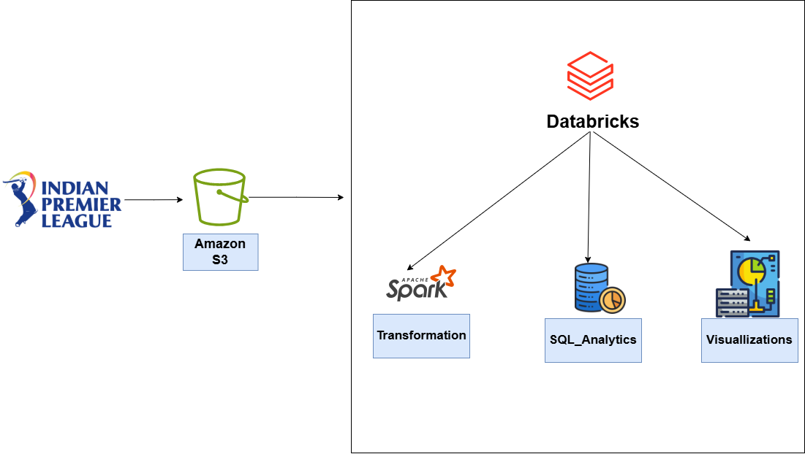

# IPL Data Analysis with Databricks and AWS S3

## Table of Contents
1. [Overview](#overview)  
2. [Architecture](#architecture)  
3. [Technologies Used](#technologies-used)  
4. [Data Sources](#data-sources)  
5. [Setup and Configuration](#setup-and-configuration)  
6. [Databricks Notebook Walkthrough](#databricks-notebook-walkthrough)  
   - [Notebook Structure](#notebook-structure)  
   - [Key Transformations and Queries](#key-transformations-and-queries)  
7. [Visualizations](#visualizations)  
8. [Insights and Observations](#insights-and-observations)  
9. [Future Enhancements](#future-enhancements)  
10. [License](#license)

---

## 1. Overview

This project demonstrates how to perform end-to-end data processing and analysis of **IPL (Indian Premier League)** cricket data using **Databricks** and **AWS S3**. The goals of this project are:

- **Data Ingestion**: Retrieve IPL match data (ball-by-ball, match, player, player-match, and team data) from Amazon S3.  
- **Data Transformation**: Use PySpark to clean, filter, transform, and join data sets for deeper analytical insights.  
- **Data Analysis**: Perform aggregations and window functions to reveal meaningful statistics such as top-scoring batsmen, economical bowlers, impact of toss decisions, and more.  
- **Data Visualization**: Leverage Matplotlib and Seaborn for visualizing trends, distributions, and relationships in the IPL data.

---

## 2. Architecture

Below is a high-level architecture diagram:


1. **Amazon S3**: IPL CSV files are stored in an S3 bucket.  
2. **Databricks**:  
   - **Transformation**: PySpark jobs clean, transform, and aggregate the data.  
   - **SQL Analytics**: Spark SQL queries to join and analyze the data.  
   - **Visualizations**: Use Matplotlib and Seaborn within Databricks notebooks to produce interactive charts.

---

## 3. Technologies Used

- **Databricks**: Primary compute and analytics platform for running Spark jobs.  
- **Apache Spark**: Distributed computing framework (PySpark) for big data processing.  
- **AWS S3**: Storage layer for raw CSV files.  
- **Python**: Core programming language.  
- **Matplotlib & Seaborn**: Libraries for creating data visualizations.  
- **SQL**: Used within Spark SQL for complex aggregations and queries.

---

## 4. Data Sources

1. **Ball_By_Ball.csv**  
   - Contains deliveries across overs and innings, runs scored on each ball, extras, and wickets.  
2. **Match.csv**  
   - Contains match-level information such as teams playing, match date, venue, and match winner.  
3. **Player.csv**  
   - Contains player information including name, date of birth, batting/bowling styles, and country.  
4. **Player_match.csv**  
   - Contains information on player appearances in matches, role, team, age during the match, captain or keeper flags, and man-of-the-match details.  
5. **Team.csv**  
   - Contains basic information on teams such as team ID and team name.

---

## 5. Setup and Configuration

1. **AWS S3**  
   - Ensure your S3 bucket is properly configured with the IPL data files (`Ball_By_Ball.csv`, `Match.csv`, `Player.csv`, `Player_match.csv`, and `Team.csv`).  
   - Update the S3 paths in the notebook to match your bucket name and folder structure.

2. **Credentials & Databricks**  
   - In your Databricks notebook, you will need to set Spark configurations to access S3. Replace or remove the placeholders for `fs.s3a.access.key` and `fs.s3a.secret.key` with secure methods (e.g., Databricks Secrets).

3. **Libraries**  
   - Ensure these libraries are available in your Databricks environment or included in your cluster's configuration:
     - `pyspark`
     - `matplotlib`
     - `seaborn`
     - `pandas` (for converting Spark data frames to Pandas data frames)
   - Make sure to import any additional libraries if they are needed.

4. **Notebook Import**  
   - Copy/paste the code from `IPL_Data_Analysis.py` (or whichever file name you choose) into a Databricks notebook.
   - Adjust the file paths to match your environment (i.e., `s3://<your-bucket>/Ball_By_Ball.csv`).

---

## 6. Databricks Notebook Walkthrough

### Notebook Structure

1. **Spark Session Creation**  
   ```python
   from pyspark.sql import SparkSession

   spark = SparkSession.builder.appName('IPL_Data_Analysis').getOrCreate()
   ```
   - Creates a Spark session named `IPL_Data_Analysis`.

2. **Configuring S3**  
   ```python
   spark._jsc.hadoopConfiguration().set("fs.s3a.access.key", "<YOUR_ACCESS_KEY>")
   spark._jsc.hadoopConfiguration().set("fs.s3a.secret.key", "<YOUR_SECRET_KEY>")
   spark._jsc.hadoopConfiguration().set("fs.s3a.endpoint", "s3.amazonaws.com")
   ```
   - Configures AWS credentials and S3 endpoint.  
   - **Important**: Use secure alternatives for storing credentials (e.g., Databricks Secrets).

3. **Reading Data**  
   ```python
   ball_by_ball_df = spark.read.csv("s3://<your-bucket>/Ball_By_Ball.csv", header=True, inferSchema=True)
   match_df = ...
   player_df = ...
   player_match_df = ...
   team_df = ...
   ```
   - Reads the IPL data from your S3 bucket into Spark DataFrames.  
   - Schema definitions (`StructType`, `StructField`) ensure typed columns and allow better handling of nulls.

4. **Data Cleaning & Transformation**  
   - **Filtering Extras** (e.g., removing wides and no-balls for specific analyses):  
     ```python
     ball_by_ball_df = ball_by_ball_df.filter((col("wides") == 0) & (col("noballs") == 0))
     ```
   - **Aggregations**: Compute total runs per match/innings, running totals, and average runs.  
   - **Window Functions**: Use partition by match/innings with order by over to calculate running totals.  
   - **Conditional Columns**: Flag high-impact balls (wickets or more than 6 runs).  
   - **Time-based columns**: Extract `year`, `month`, `day` from `match_date`.  
   - **Normalization**: Clean player names, handle missing values, categorize batting and bowling styles.  

5. **SQL Views**  
   ```python
   ball_by_ball_df.createOrReplaceTempView("ball_by_ball")
   match_df.createOrReplaceTempView("match")
   ...
   ```
   - Creates temporary views for Spark SQL queries, making it easier to join and filter in SQL syntax.

6. **Advanced SQL Queries**  
   - **Top Scoring Batsmen Per Season**  
   - **Economical Bowlers in Powerplay**  
   - **Impact of Toss Decisions**  
   - **Batting Performance in Winning Matches**  

### Key Transformations and Queries

- **Top Scoring Batsmen**:
  ```sql
  SELECT p.player_name, m.season_year, SUM(b.runs_scored) AS total_runs
  FROM ball_by_ball b
  JOIN match m ON b.match_id = m.match_id
  JOIN player_match pm ON m.match_id = pm.match_id AND b.striker = pm.player_id
  JOIN player p ON p.player_id = pm.player_id
  GROUP BY p.player_name, m.season_year
  ORDER BY m.season_year, total_runs DESC
  ```
- **Economical Bowlers in Powerplay**:
  ```sql
  SELECT p.player_name,
         AVG(b.runs_scored) AS avg_runs_per_ball,
         COUNT(b.bowler_wicket) AS total_wickets
  FROM ball_by_ball b
  ...
  WHERE b.over_id <= 6
  ...
  ORDER BY avg_runs_per_ball, total_wickets DESC
  ```
- **Toss Decision Impact**:
  ```sql
  SELECT LOWER(toss_name) AS toss_decision,
         COUNT(match_id) AS total_matches,
         SUM(CASE WHEN toss_winner = match_winner THEN 1 ELSE 0 END) AS toss_winner_wins,
         ROUND(100.0 * SUM(CASE WHEN toss_winner = match_winner THEN 1 ELSE 0 END) / COUNT(match_id), 2) AS win_percentage
  ...
  ```

---

## 7. Visualizations

Several plots are generated with **Matplotlib** and **Seaborn**:

1. **Most Economical Bowlers (Bar Plot)**  
   - Displays average runs per ball in the powerplay.  
2. **Toss Impact (Countplot)**  
   - Illustrates the number of matches won/lost by the toss-winning team.  
3. **Win Percentage by Toss Decision (Bar Plot)**  
   - Shows the win percentage for “bat” vs “field” decisions.  
4. **Batting Performance in Wins (Bubble Chart)**  
   - Plots average runs vs. strike rate, with bubble size indicating innings played.

Example snippet for visualization:
```python
import matplotlib.pyplot as plt
import seaborn as sns

# Convert Spark DataFrame to Pandas
economical_bowlers_pd = economical_bowlers_powerplay.toPandas()

plt.figure(figsize=(12, 8))
top_economical_bowlers = economical_bowlers_pd.nsmallest(10, 'avg_runs_per_ball')
plt.bar(top_economical_bowlers['player_name'], top_economical_bowlers['avg_runs_per_ball'], color='skyblue')
plt.xlabel('Bowler Name')
plt.ylabel('Average Runs per Ball')
plt.title('Most Economical Bowlers in Powerplay Overs (Top 10)')
plt.xticks(rotation=45)
plt.tight_layout()
plt.show()
```

---

## 8. Insights and Observations

- **High-Scoring Batsmen**: We can identify which players consistently top the charts in different seasons.  
- **Powerplay Bowling**: Some bowlers stand out for being both economical and wicket-taking in the first 6 overs.  
- **Toss Impact**: Certain toss decisions (bat vs. field) can significantly affect match outcomes, especially in specific conditions or venues.  
- **Player Performance**: Analyzing average runs and strike rates for players on winning teams provides insights into clutch performances.

---

## 9. Future Enhancements

1. **More Detailed Bowling Analytics**  
   - Incorporate economy rates for entire innings, death overs, or middle overs.  
2. **Fielding Analysis**  
   - Explore catch and run-out statistics per fielder.  
3. **Predictive Modeling**  
   - Build machine learning pipelines to predict match outcomes or player-of-the-match based on historical data.  
4. **Deployment**  
   - Automate data ingestion and transformations with Airflow or Databricks Jobs.  
5. **Streamlined Credentials**  
   - Use Databricks Secrets or AWS IAM Roles instead of storing plain-text credentials in the notebook.

---

## 10. License

This project is licensed under the [MIT License](./LICENSE). Feel free to modify and adapt for your own purposes, but please give credit to this repository for the original structure and code if you choose to fork or reuse.

---

**Note**:  
1. Make sure to **remove or obfuscate** any sensitive information (AWS keys, access tokens, etc.) before committing your code to a public repository.  
2. This README assumes a basic familiarity with Databricks and Spark. For detailed instructions on creating a Databricks cluster or accessing S3, please refer to the official [Databricks documentation](https://docs.databricks.com/) and [AWS documentation](https://docs.aws.amazon.com/).  

Enjoy exploring IPL data insights with Spark on Databricks!  

---  

**Author**: Your Name  
**Date**: 2025-04-13  
